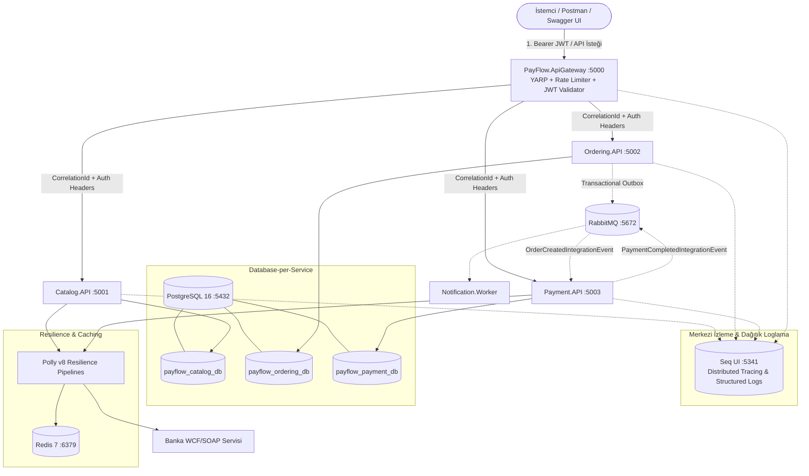

# PayFlow: Enterprise .NET 9 Dağıtık Mikroservis & Ödeme Orkestrasyonu Platformu

[](https://dotnet.microsoft.com/)
[](https://learn.microsoft.com/dotnet/csharp/)
[](https://www.postgresql.org/)
[](https://www.rabbitmq.com/)
[](https://redis.io/)
[](https://www.docker.com/)
[](https://datalust.co/seq)
[](https://github.com/App-vNext/Polly)
[](LICENSE)

> **PayFlow**, yüksek trafikli (10.000+ kullanıcı) sistemlerde kullanılan modern dağıtık yazılım mimarilerini, tasarım kalıplarını ve kıdemli (Senior) .NET mühendisliği pratiklerini birebir içeren kurumsal bir **Fintech & Ödeme Orkestrasyonu** platformudur.

---

## 🏛️ Mimari Tasarım & Veri Akışı



---

## 🚀 Öne Çıkan Teknolojiler & Kütüphaneler

| Alan | Teknoloji / Kütüphane | Kullanım Amacı |
| :--- | :--- | :--- |
| **Framework & Dil** | .NET 9, C# 13 | Primary Constructors, Collection Expressions, Minimal APIs |
| **API Gateway** | Microsoft YARP (Yet Another Reverse Proxy) | Yüksek performanslı ters proxy, istek yönlendirme, CORS |
| **Trafik & Güvenlik** | ASP.NET Core Rate Limiter, JWT Bearer | Fixed Window Rate Limiting (DDoS koruması), RBAC yetkilendirme |
| **Veri Katmanı** | PostgreSQL 16, EF Core 9, Npgsql | Database-per-Service mimarisi, izole veritabanları, Seed Data |
| **Önbellek** | Redis 7, StackExchange.Redis | 10.000+ okuma yükü için Cache-Aside Pattern |
| **Mesajlaşma** | RabbitMQ 3.13, MassTransit | Asenkron, gevşek bağlı (loosely-coupled) Event-Driven mimari |
| **Dayanıklılık** | Polly v8 Resilience Pipelines | Circuit Breaker, Exponential Backoff with Jitter, Timeout, Fallback |
| **İzlenebilirlik** | Serilog, Seq, OpenTelemetry | X-Correlation-ID takibi, yapılandırılmış dağıtık loglama |
| **Eski Sistem Uyumu** | System.ServiceModel (WCF / SOAP) | Kurumsal banka servisleri ile XML/SOAP tabanlı haberleşme |
| **Mimari Kalıplar** | Clean Architecture, CQRS (MediatR), Outbox | Dual-write koruması, DDD Aggregate Root, Result Pattern |
| **Test & Kalite** | xUnit, FluentAssertions, Moq | Domain Invariants ve CQRS Handler birim testleri |
| **DevOps & Dağıtım** | Docker Compose, Kubernetes, GitHub Actions | Multi-stage konteynerizasyon, K8s manifestleri ve CI/CD pipeline |

---

## 💡 Mülakatlarda Seni Öne Çıkaracak 8 Kritik Mimari Kalıp

### 1. Transactional Outbox Pattern & Dual-Write Çözümü
*   **Problem:** Bir sipariş DB'ye kaydedilip hemen ardından RabbitMQ'ya mesaj fırlatılırsa (**Dual-Write**), broker çöktüğünde sipariş veritabanında kalır ama ödeme/stok tetiklenmez. Dağıtık sistemlerde veri tutarsızlığı oluşur.
*   **Çözümümüz:** Sipariş entity'si ile `OutboxMessage` aynı veritabanı transaction'ında kaydedilir. Arka plandaki `OutboxProcessor` (BackgroundService) işlenmemiş mesajları alır, RabbitMQ'ya iletir ve durumu günceller. Mesaj iletimi %100 garanti altına alınır (**At-Least-Once Delivery**).
*   Detaylı Rapor: [ADR-001: Transactional Outbox Pattern](docs/adr/ADR-001-transactional-outbox-pattern.md)

### 2. Database-per-Service (PostgreSQL 16 Multi-DB)
*   Monolitik veritabanı anti-pattern'ı yerine her mikroservisin (`payflow_catalog_db`, `payflow_ordering_db`, `payflow_payment_db`) kendi izole veritabanı vardır.
*   Servisler birbirlerinin tablolarına doğrudan SQL sorgusu atamaz; iletişim REST API veya RabbitMQ Event Bus üzerinden sağlanır.
*   Detaylı Rapor: [ADR-002: Database-per-Service ve PostgreSQL](docs/adr/ADR-002-database-per-service-postgresql.md)

### 3. Cache-Aside Pattern & Graceful Degradation (10.000+ Kullanıcı Ölçeği)
*   `Catalog.API` servisinde ürün listesi her istekte DB'ye gitmez: Önce Redis kontrol edilir (Sub-millisecond). Cache Miss durumunda DB'den çekilip Redis'e 10 dk TTL ile yazılır.
*   **Hata Toleransı (Resilience):** Redis kapalı olsa dahi sistem 500 hatası vermez; log yazıp DB'ye sorunsuz fallback yapar (**Graceful Degradation**).

### 4. Polly v8 ile Circuit Breaker ve Üstel Gecikmeli Retry (Jitter Destekli)
*   `Payment.API` dış banka SOAP servisine bağlanırken geçici ağ hataları için **Exponential Backoff with Jitter** uygular.
*   Banka arızası durumunda thread'lerin kilitlenmesini ve sistemin çökmesini engellemek için **Circuit Breaker** devreye girer: Hata oranı %50'yi aşarsa devre açılır (`Circuit OPEN`) ve 15 saniye boyunca bankaya yeni istek gönderilmez.
*   Detaylı Rapor: [ADR-003: Polly ve Circuit Breaker](docs/adr/ADR-003-resilience-and-circuit-breaker-with-polly.md)

### 5. Dağıtık Sistemlerde Idempotency (Mükerrer İstek Koruması)
*   RabbitMQ gibi sistemler "At-Least-Once" garanti verdiği için aynı event iki kez iletilebilir.
*   `Payment.API` servisinde `OrderId` alanı üzerinde veritabanı seviyesinde kontrol yapılır. Aynı sipariş için ikinci kez event geldiğinde mükerrer ödeme çekilmesi engellenir.

### 6. WCF/SOAP ve Modern REST Birlikteliği
*   Modern dünyada RESTful JSON kullanılırken kamu ve bankacılık altyapılarında WCF/SOAP XML servisleri standarttır.
*   `PayFlow.Payment.API`, `System.ServiceModel.Http` kullanarak `BasicHttpBinding` ile SOAP zarfı oluşturur ve bankayla haberleşir.

### 7. Merkezi Kimlik Doğrulama & Yetkilendirme (JWT Bearer & RBAC)
*   Gateway seviyesinde merkezi JWT token üretimi ve doğrulaması yapılır.
*   `POST /api/orders` gibi hassas uç noktalar `Customer` veya `Admin` rolü gerektirir.

### 8. Seq & OpenTelemetry ile Uçtan Uca Dağıtık İzleme (Observability)
*   Her isteğe bir `X-Correlation-ID` atanır ve bu kimlik tüm HTTP çağrıları, loglar ve RabbitMQ mesaj başlıkları boyunca aktarılır.
*   Mülakatta `http://localhost:5341` (Seq) arayüzünü açarak tek bir Correlation ID ile bir siparişin tüm yaşam döngüsünü canlı olarak izleyebilirsiniz.
*   Detaylı Rapor: [ADR-004: Seq ile Dağıtık İzleme](docs/adr/ADR-004-distributed-tracing-and-observability-seq.md)

---

## 🛠️ Nasıl Çalıştırılır?

### Tek Komutla Ayağa Kaldırma (Docker Compose)
Tüm altyapıyı (PostgreSQL, RabbitMQ, Redis, Seq, Mikroservisler ve Gateway) tek bir komutla ayağa kaldırabilirsiniz:

```bash
docker compose up -d --build
```

Ayağa kalkan uç noktalar:
*   **PayFlow Hub (İnteraktif Web Kontrol Paneli):** [http://localhost:5000](http://localhost:5000) ⚡
*   **API Gateway (Swagger UI):** [http://localhost:5000/swagger](http://localhost:5000/swagger)
*   **Seq (Merkezi Loglama & Dağıtık İzleme Paneli):** [http://localhost:5341](http://localhost:5341)
*   **RabbitMQ Yönetim Paneli:** [http://localhost:15672](http://localhost:15672) (Kullanıcı / Şifre: `guest` / `guest`)
*   **Catalog API (Swagger):** [http://localhost:5001](http://localhost:5001)
*   **Ordering API (Swagger):** [http://localhost:5002](http://localhost:5002)
*   **Payment API (Swagger):** [http://localhost:5003](http://localhost:5003)
*   **PostgreSQL Portu:** `localhost:5432` (Kullanıcı: `postgres`, Şifre: `Password123!`)

---

## 📬 Postman ile Hızlı Test

Proje kök dizinindeki [PayFlow.postman_collection.json](PayFlow.postman_collection.json) dosyasını Postman'e import ederek 1 dakika içinde uçtan uca akışı test edebilirsiniz:

1.  **Health Check:** `GET /health` ile servis durumunu doğrulayın.
2.  **JWT Girişi:** `POST /api/auth/login` (`customer@payflow.com` / `Password123!`) çağrısını yapın. Token otomatik olarak Postman değişkenine atanır.
3.  **Katalog İnceleme:** `GET /api/catalog` ile ürünleri çekin (1. istek veritabanından, 2. istek Redis'ten gelir).
4.  **Sipariş Oluşturma:** `POST /api/orders` ile sipariş gönderin.
5.  **Ödeme Doğrulama:** `GET /api/payments` ile banka SOAP onayını ve işlem kodunu görüntüleyin.
6.  **Seq İnceleme:** `http://localhost:5341` adresine gidip `CorrelationId` filtresi ile tüm akışın loglarını inceleyin!

---

## 🧪 Birim ve Entegrasyon Testleri

```bash
dotnet test
```

Tüm domain invariant kuralları ve Transactional Outbox atomik kayıt mantığı xUnit testleri ile doğrulanmıştır:
- **Sonuç:** `10 Başarılı, 0 Başarısız`.

---

## 📂 Proje Dizin Yapısı

```text
PayFlow-Microservices/
├── docker/
│   └── postgres/
│       └── init-databases.sql         # Multi-database oluşturma scripti
├── docs/
│   └── adr/                           # Mimari Karar Kayıtları (ADR)
├── src/
│   ├── ApiGateways/
│   │   └── PayFlow.ApiGateway/        # YARP, Rate Limiting, JWT Auth, Swagger
│   ├── BuildingBlocks/
│   │   └── PayFlow.SharedKernel/      # Result Pattern, CQRS, Events, Logging, JWT
│   └── Services/
│       ├── Catalog/PayFlow.Catalog.API/           # PostgreSQL, Redis Cache-Aside
│       ├── Ordering/PayFlow.Ordering.API/         # Clean Arch, CQRS, Outbox Worker
│       ├── Payment/PayFlow.Payment.API/           # WCF/SOAP, Idempotency, Polly
│       └── Notification/PayFlow.Notification.Worker/ # RabbitMQ Bildirim Tüketicisi
├── tests/
│   └── PayFlow.Ordering.UnitTests/    # xUnit, FluentAssertions, Moq
├── docker-compose.yml                 # PostgreSQL + RabbitMQ + Redis + Seq + Servisler
└── PayFlow.postman_collection.json    # Otomatik test koleksiyonu
```

---

## 📄 Lisans
Bu proje [MIT](LICENSE) lisansı altında sunulmaktadır. CV'nizde ve portföyünüzde serbestçe kullanabilir, referans gösterebilirsiniz.
